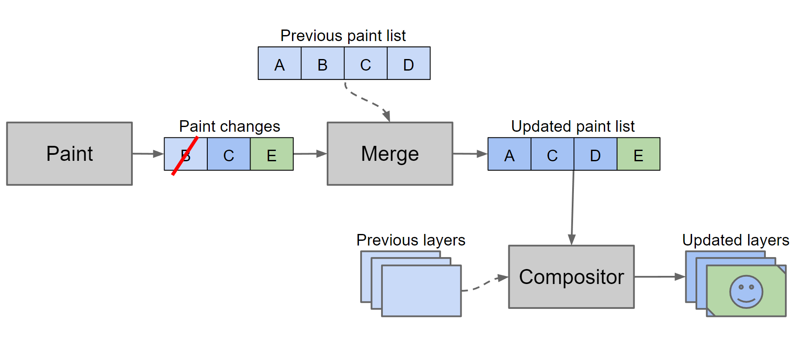

# 浏览器基础原理

### 神文：How browsers work

- 中文版本：[https://www.html5rocks.com/zh/tutorials/internals/howbrowserswork/](https://www.html5rocks.com/zh/tutorials/internals/howbrowserswork/】)
- 英文版本：[https://www.html5rocks.com/en/tutorials/internals/howbrowserswork/](https://www.html5rocks.com/en/tutorials/internals/howbrowserswork/)

### 浏览器合成线程（Composite thread）与CSS动画的性能优化

[http://zencode.in/18.CSS-animation%E5%92%8Ctransition%E7%9A%84%E6%80%A7%E8%83%BD%E6%8E%A2%E7%A9%B6.html](http://zencode.in/18.CSS-animation%E5%92%8Ctransition%E7%9A%84%E6%80%A7%E8%83%BD%E6%8E%A2%E7%A9%B6.html)

### 深度阅读（更深入的理解Chrome的GPU硬件加速）

- 旧版本实现：[https://www.chromium.org/developers/design-documents/gpu-accelerated-compositing-in-chrome](https://www.chromium.org/developers/design-documents/gpu-accelerated-compositing-in-chrome)
- 新玩法Blink引擎的Slimming Paint
  - 
  - Blink 3的介绍PPT [https://docs.google.com/presentation/d/1zpGlx75eTNILTGf3s\\_F6cQP03OGaN2-HACsZwEobMqY/edit#slide=id.g40cfae859\\_015](https://docs.google.com/presentation/d/1zpGlx75eTNILTGf3s\_F6cQP03OGaN2-HACsZwEobMqY/edit#slide=id.g40cfae859\_015)
  - Slimming Paint首页：[https://www.chromium.org/blink/slimming-paint](https://www.chromium.org/blink/slimming-paint)
