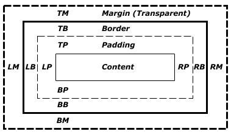

# CSS 布局

基础知识《学习CSS》：[http://zh.learnlayout.com/](http://zh.learnlayout.com/)

### 正常文档流

- 块级元素（`display:block`）
- 行内元素（`display:inline | inline-block`）
- 包含块（containing block），一个元素的尺寸和位置经常受其包含块的影响。大多数情况下，包含块就是这个元素最近的祖先块元素的内容区，但也不是总是这样

### 盒模型公式

块级元素在默认情况下（`box-sizing`默认值）的水平方向计算公式如下：

> margin-left + border-left + padding-left + width + padding-right + border-right + margin-right = 包含框的内容区域宽度

`margin`值为`auto`时，会自动补全剩余宽度，如果`margin-left`和`margin-right`都是`auto`则均分。

- 应用的案例1：`margin:auto`实现水平居中
- 应用的案例2：绝对定位的一种居中实现方式：[http://zencode.in/margin-auto/](http://zencode.in/margin-auto/)

### 浮动

​浮动的九条准则：

- 【容易忽略】元素被视作块级元素，相当于display设置为“block”；
- 【容易忽略】元素具备包裹性，会根据它所包含的元素实现宽度、高度自适应；
- 浮动元素前后的块级兄弟元素忽视浮动元素的而占据它的位置，并且元素会处在浮动元素的下层（并且无法通过z-index属性改变他们的层叠位置），但它的内部文字和其他行内元素都会环绕浮动元素（可以实现文字环绕效果）；
- 浮动元素前后的行内元素环绕浮动元素排列；
- 浮动元素之前的元素如果也是浮动元素，且方向相同，它会紧跟在它们后面；父元素宽度不够，换行展示；
- 浮动元素之间的水平间距不会重叠；
- 当包含元素中只有浮动元素时，包含元素将会高度塌陷；
- 浮动元素的父元素的非浮动兄弟元素，忽视浮动元素存在，覆盖浮动元素；
- 浮动元素的父元素的浮动兄弟元素，会跟随浮动元素布局，仿佛处在同一父元素中；

​清除浮动的方法：[https://stackoverflow.com/questions/211383/what-methods-of-clearfix-can-i-use](https://stackoverflow.com/questions/211383/what-methods-of-clearfix-can-i-use)

更为详细的CSS浮动标准的介绍文章：[http://www.10tiao.com/html/399/201612/2651493371/1.html](http://www.10tiao.com/html/399/201612/2651493371/1.html)

### BFC（块格式化上下文 Block Formatting Context）

​[https://developer.mozilla.org/zh-CN/docs/Web/Guide/CSS/Block\\_formatting\\_context](https://developer.mozilla.org/zh-CN/docs/Web/Guide/CSS/Block\_formatting\_context)

BFC是Web页面的可视化CSS渲染的一部分，是布局过程中生成块级盒子的区域，也是浮动元素与其他元素的交互限定区域。

- 应用的案例：[不定宽度的左图又文布局]([http://jsbin.com/gijixiz/1/edit?html,css,output](http://jsbin.com/gijixiz/1/edit?html,css,output)

浮动定位和清除浮动时只会应用于同一个BFC内的元素，浮动不会影响其它BFC中元素的布局，而清除浮动只能清除同一BFC中在它前面的元素的浮动。

- 应用的案例：`overflow:hidden`可以清除内部浮动

外边距折叠（Margin collapsing）也只会发生在属于同一BFC的块级元素之间

### 绝对定位

z-index顺序：两个绝对定位元素的先后顺序由他们最顶层的不相同的“`position`值非`static`”的祖先元素（没有的话就是自己）的z-index来决定的。

`position:absolute`元素的宽度如果是百分比，则是相对于其包含块的。包含块是它的最近的“`position`值非`static`”的祖先元素的内边距区的边缘组成。

### CSS Flex

TBD

### CSS Grid

TBD

### 常见布局问题

- 传统布局方式（float + position）
  - 圣杯布局: [http://alistapart.com/article/holygrail](http://alistapart.com/article/holygrail)
  - 双飞翼布局 [http://www.imooc.com/wenda/detail/254035](http://www.imooc.com/wenda/detail/254035)
  - 等高布局的几种玩法：[https://css-tricks.com/fluid-width-equal-height-columns/](https://css-tricks.com/fluid-width-equal-height-columns/)
  - 多栏布局，inline-block实现的网格基础库，可以套用到很多实现方式，注意letter-space的使用：[https://purecss.io/grids/](https://purecss.io/grids/)
- 用flexbox实现常见布局：[https://philipwalton.github.io/solved-by-flexbox/](https://philipwalton.github.io/solved-by-flexbox/)
- CSS grid [https://css-tricks.com/snippets/css/complete-guide-grid/](https://css-tricks.com/snippets/css/complete-guide-grid/)
- 移动端1px解决方案：[https://juejin.im/entry/584e427361ff4b006cd22c7c](https://juejin.im/entry/584e427361ff4b006cd22c7c)
- 响应式设计中的固定高宽比的实现：[https://spin.atomicobject.com/2015/07/14/css-responsive-square/](https://spin.atomicobject.com/2015/07/14/css-responsive-square/) ，一般用来实现视频等需要事先占位或者不能等比例缩放的元素
- CSS border实现三角、圆形： [http://www.zhangxinxu.com/wordpress/2010/05/css-border%E4%B8%89%E8%A7%92%E3%80%81%E5%9C%86%E8%A7%92%E5%9B%BE%E5%BD%A2%E7%94%9F%E6%88%90%E6%8A%80%E6%9C%AF%E7%AE%80%E4%BB%8B/](http://www.zhangxinxu.com/wordpress/2010/05/css-border%E4%B8%89%E8%A7%92%E3%80%81%E5%9C%86%E8%A7%92%E5%9B%BE%E5%BD%A2%E7%94%9F%E6%88%90%E6%8A%80%E6%9C%AF%E7%AE%80%E4%BB%8B/)

### 网格系统

> **栅格设计系统**（又称**网格设计系统**、**标准尺寸系统**、**程序版面设计**、**瑞士平面设计风格**、**国际主义平面设计风格**），是一种[平面设计](https://zh.wikipedia.org/wiki/%E5%B9%B3%E9%9D%A2%E8%AE%BE%E8%AE%A1 "平面设计")的方法与风格。运用固定的格子设计版面布局，其风格工整简洁，在二战后大受欢迎，已成为今日出版物设计的主流风格之一。 来自[Wiki](https://zh.wikipedia.org/wiki/%E6%A0%85%E6%A0%BC%E8%AE%BE%E8%AE%A1)。

网页设计中网格系统应用的也很多，例如以前常见的基于960px的网格系统。在响应式设计流行之后，常见的CSS库都已经支持基于百分比的网格系统。

| 开源库                                                          | 实现方式       | 浏览器支持成都               |
| -------------------------------------------------------------- | -------------- | --------------------------- |
| [purecss](https://purecss.io/)                                 | `inline-block` | IE 8+, iOS 6+, Android 4.x+ |
| [bootstrap v3](https://getbootstrap.com/docs/3.3/css/#grid)    | `float`        | IE 8+                       |
| [bootstrap v4](https://getbootstrap.com/docs/4.1/layout/grid/) | `flexbox`      | IE10+, iOS 7+, Android 5.x+ |
