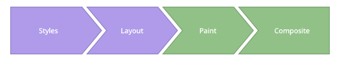

# CSS渲染及动画优化

### 渲染流程

- Styles: 浏览器计算样式，并应用到元素上
- Layout: 布局，为每个元素生成形状大小（盒模型）和位置（包括元素间的布局关系），并计算出layers（层，chrome console中有个layer视图可以一窥究竟）
- Paint: 绘制每个元素的像素点到layers中
- Composite: 合成，把多个layers合成并画到屏幕上（合成部分可以参考[浏览器基础](./basic.md)的合成线程相关知识）

### CSS动画优化

- [https://www.html5rocks.com/zh/tutorials/speed/high-performance-animations/](https://www.html5rocks.com/zh/tutorials/speed/high-performance-animations/)
- [https://developers.google.com/web/fundamentals/performance/rendering/stick-to-compositor-only-properties-and-manage-layer-count?hl=zh-cn](https://developers.google.com/web/fundamentals/performance/rendering/stick-to-compositor-only-properties-and-manage-layer-count?hl=zh-cn)

### 样式的变化及其分别对应的触发的渲染流程

[https://csstriggers.com/](https://csstriggers.com/)
